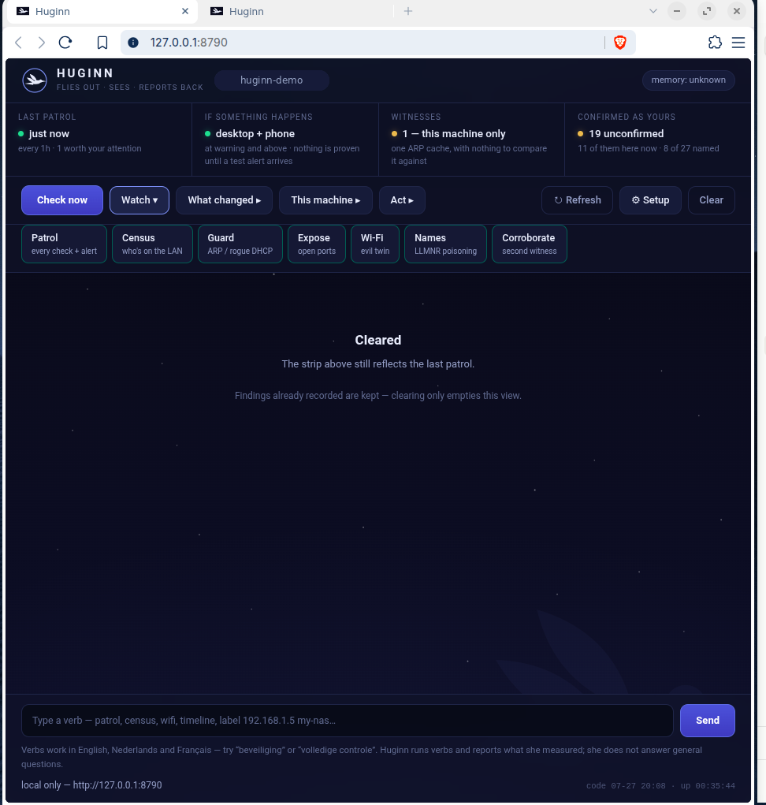
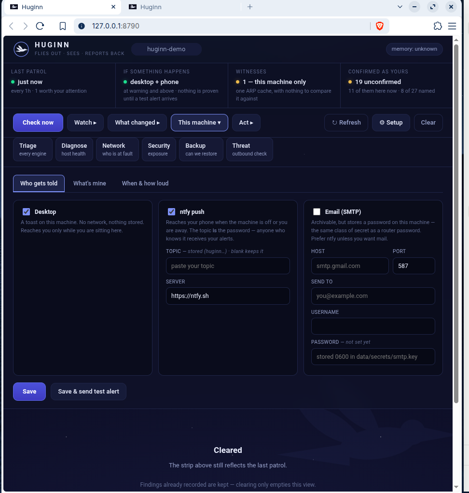
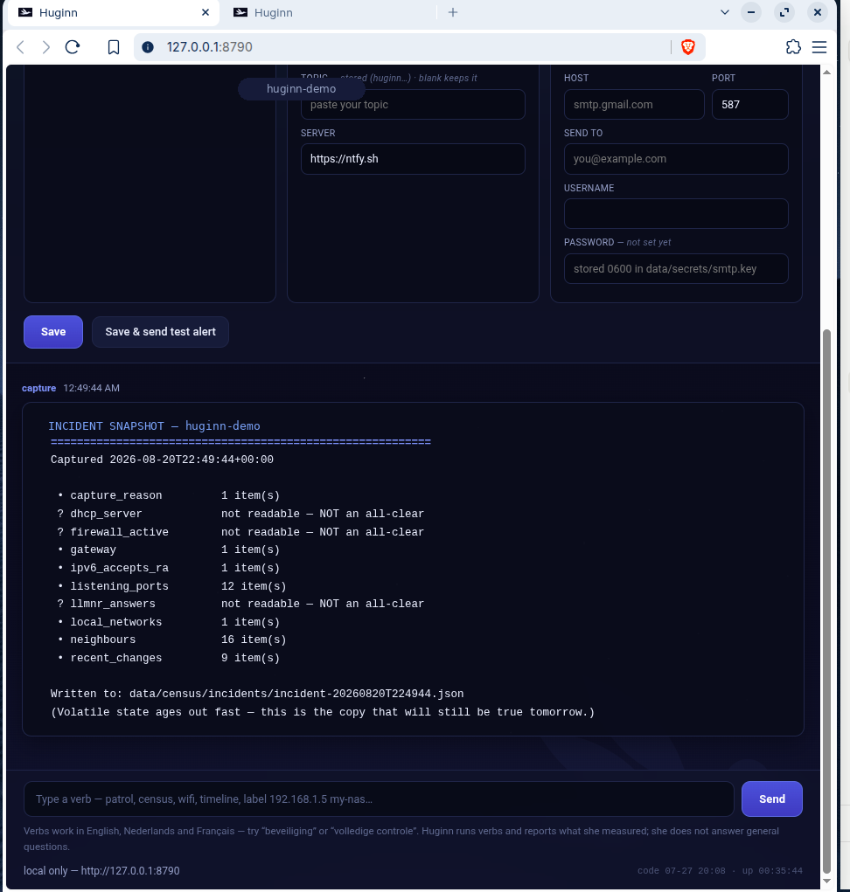

# Huginn

[](LICENSE)

**A network watchdog built around one unusual idea: radical honesty about
what it did and did not check.**

Huginn watches a single network — a home or a small office — and tells you
what changed: a device you do not recognise joining, something impersonating
your router, a fake copy of your Wi-Fi, a machine talking to a known-bad
address. It never acts on your network (it detects and *proposes*, you
decide), and it never lets "not checked" look like "all clear".

This repository contains Huginn **and the two companion tools it uses**, so
it is complete on clone — nothing to fetch, nothing to wire up.



## What it looks like

The console is a single local page — no account, no cloud. The four boxes
across the top are the whole answer to *"is my network OK right now?"*, in
plain traffic-light colours. Grey means **not checked** — never dressed up
as green.

| | |
| - | - |
|  |  |
| **Set up once** — who gets told, and how loud. | **Honest output** — what it could *not* read is stated, never hidden. |

## What's in here

| Folder | What it is | Language |
| - | - | - |
| [`ops-platform/`](ops-platform/) | **Huginn itself** — the console, the checks, the alerting, the LAN + Wi-Fi watch | Python (stdlib only) |
| [`network/`](network/) | **netdiag** — the network diagnostician Huginn calls to answer "the internet is bad, whose fault is it" | Go (stdlib only) |
| [`diagnostics/`](diagnostics/) | **Diagnostic Companion** — the host-health engine Huginn calls for "is this computer healthy" | Python |

Huginn runs on its own too: without the companions beside it, those two
engines simply report themselves unavailable (honestly, never as a false
"all clear"). Together, it is the complete tool.

## Start here

- **Just want it running on Windows?** →
  [`ops-platform/docs/WINDOWS-QUICKSTART.md`](ops-platform/docs/WINDOWS-QUICKSTART.md)
  (double-click, no terminal).
- **The full guide, for any system, with a glossary** →
  [`ops-platform/docs/MANUAL.md`](ops-platform/docs/MANUAL.md).
- **Huginn's own README** (design rules, layout, tests) →
  [`ops-platform/README.md`](ops-platform/README.md).

Quick run on Linux/macOS:

```bash
cd ops-platform
./huginn          # open the console in your browser (local only)
./ops patrol      # or run one full check from the terminal
```

## The idea that ties all three together

All three projects were built to the same rule, and it is the reason they
exist:

> **Absence is never health.** A check that could not run must never look
> like a check that passed.

Each carries its coverage, degrades honestly when a tool is missing, and
enforces its own structure with tests rather than good intentions. Huginn
adds two more: **detect and propose, never act** (no blocking, ever), and
**zero dependencies** — Python and Go standard libraries only, no install
tree, nothing that phones home.

## Status and honesty

Working tools, verified on real **Linux, Windows, and macOS**, with
recovery-from-backup demonstrated. The macOS run earned its keep: it found
a real bug — the connection parser was shaped for Linux/Windows and silently
matched zero rows of BSD `netstat` — which is now fixed and covered by tests
built from the real output. Also personal-scale: run on a small number of
networks for a short time, not a fleet for years. A couple of platform paths
(a Hyper-V console reader, a Windows file-ACL lockdown, and a macOS build of
the `netdiag` companion) are not yet confirmed against the real thing — and
say so in their own comments. If something here does not do what the docs
claim, that is a bug worth reporting: these projects treat a false "all
clear" as the worst possible outcome.

### Verified on macOS (real run)

The smoke test on a real macOS machine, after the connection-parser fix —
every check either passes or honestly *skips*, and nothing is faked:

```
Ops Platform smoke test — Darwin 23.6.0
  ok    environment: platform_support resolves this OS   detected darwin
  ok    engine: Diagnostic Companion is actually runnable
  ok    connections: engine lists this machine's connections   20 rows -> 8 parsed
  skip  engine: netdiag binary resolves for this OS      no macOS netdiag binary yet
  skip  backup: sandbox kind resolves for this OS        no hypervisor on macOS
  ...
  12 passed, 0 failed, 4 skipped
  Skipped checks are NOT passes — they are things this machine could not verify.
```

## License

Huginn and both companion tools are licensed under the **GNU Affero General
Public License v3.0 (AGPLv3)** — see [`LICENSE`](LICENSE). Each of the three
projects also carries its own copy of the license.

In plain terms: **this software is free, and it stays free.** You may use
it, read it, change it, and share it. But if you distribute it — or run a
modified version as a service that others reach over a network — you must
pass the source on, under this same license. No one can take it, close the
source, and lock people out. That is the whole point of the choice.

## Contributing & changes

Contributions are welcome — see [`CONTRIBUTING.md`](CONTRIBUTING.md) for the
one rule everything here is built on. Release notes live in
[`CHANGELOG.md`](CHANGELOG.md).
